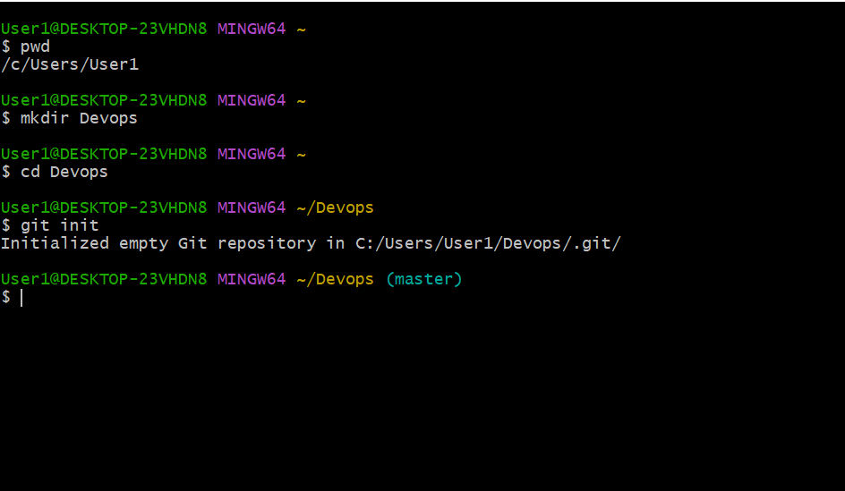
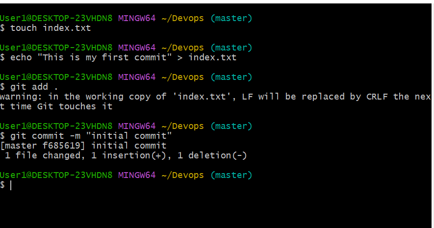
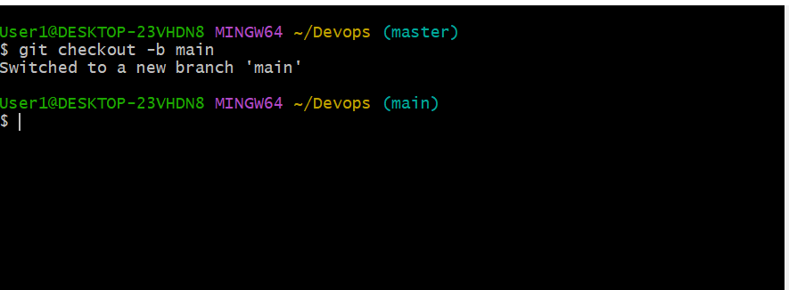
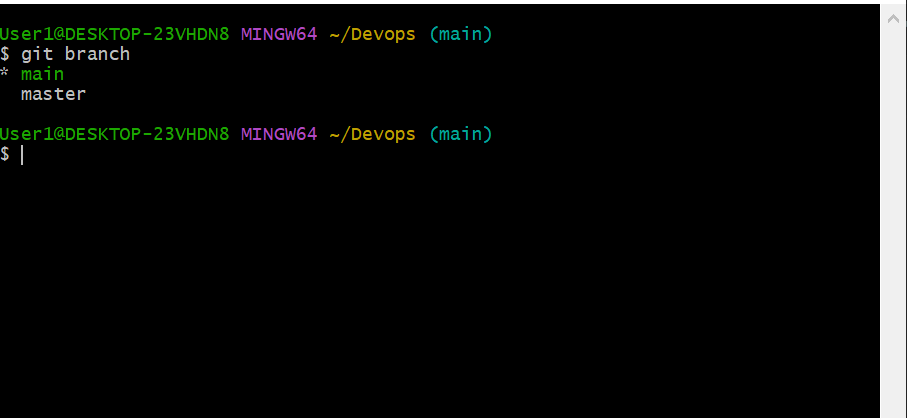
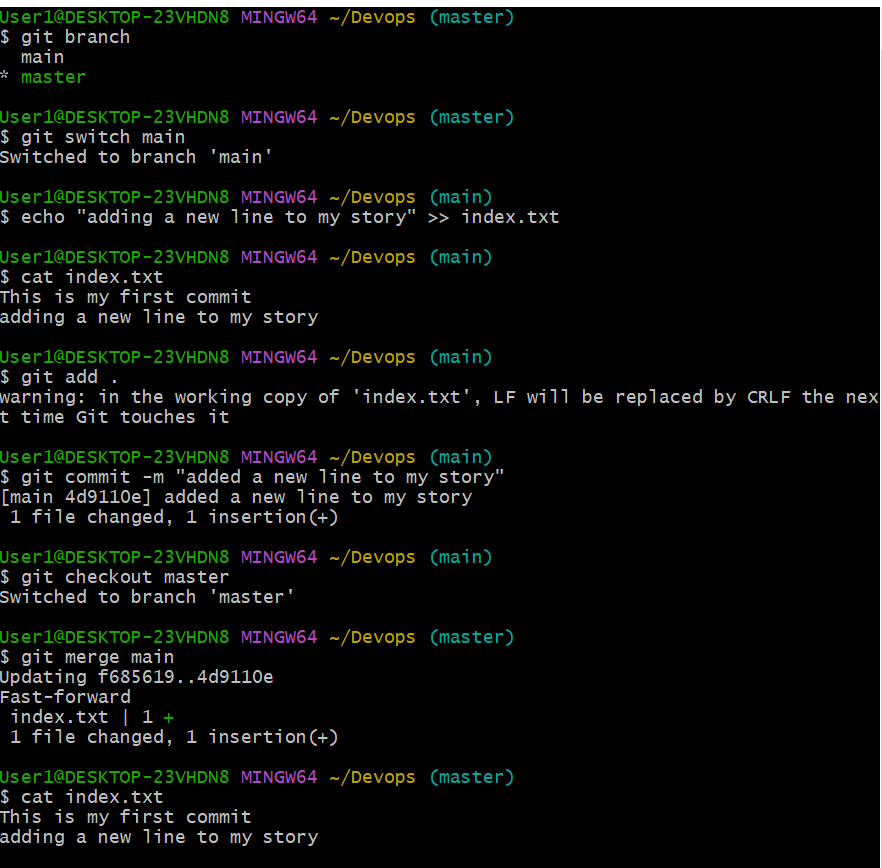
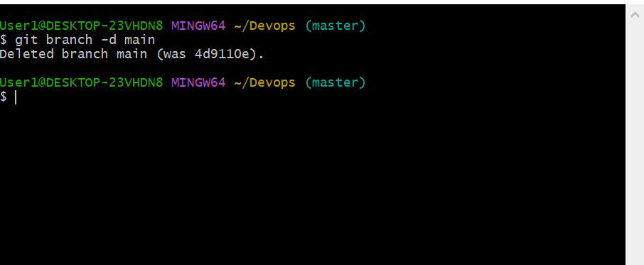
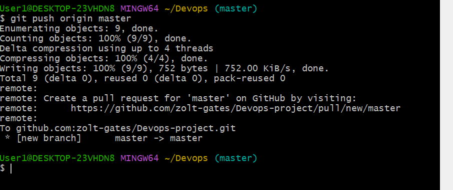
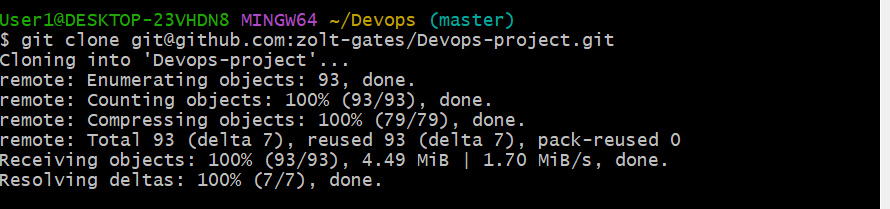

# PROJECT 2 GIT

## git init
`git init` is the command you use to initialize a new Git repository in a directory. When you run this command, Git creates a hidden .git folder within that directory, which will store all the version control information and configurations for your project.

## git commit

After making changes to your code, you use `git commit -m` to save those changes with a descriptive message. This creates a new snapshot of your code, allowing you to track its history and refer back to specific versions if needed.

## git checkout -b {branch name}
`git checkout -b {branch name}` is used to create and switch to a new branch named "main" (or any other branch name you specify). Branches allow you to work on different features or bug fixes independently, keeping your changes isolated until you're ready to merge them into the main codebase.

## git branch
`git branch` lists all the branches in your repository. It helps you see what branches exist and which one you're currently on. An asterisk (*) typically marks the current branch.

## git checkout

`git checkout master` is used to switch to the "master" branch (or any other branch you specify). You can use this command to move between branches and work on different parts of your project.

## git merge

`git merge` is used to combine changes from one branch into another. Typically, you would use it to merge a feature branch into the main branch after you've completed and tested your changes.

## git branch -d

`git branch -d` is used to delete a branch once you no longer need it. This is helpful for cleaning up your repository and removing branches that have served their purpose.

## git push origin {branch name}

`git push origin main` is used to push your local changes to the "main" branch of the remote repository (specified as "origin"). This makes your local changes available to others and updates the remote repository with your latest code.

## git clone

`git clone` is used to create a copy of a remote Git repository on your local machine. This command allows you to start working on an existing project, download all its history, and collaborate with others by cloning their repositories.

