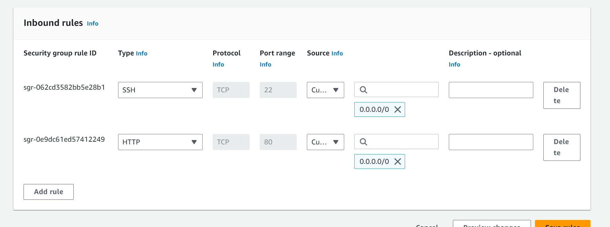

## PROJECT 3 LAMP STACK

### Create an EC2 instance on AWS console

Login to the AWS console and search for EC2

click launch instance, select the type AMI for ubuntu, the amount of instance should remain as 1, specify the key pair for logging into the instance, leave the other options as default(intance type t2.micro, volume for storage). Specify the creation of a security group and enable SSH on port 22.

Click Launch Instance button, select Amazon Linux AMI (HVM), SSD Volume Type, t2.micro as type of machine and click Launch Instance

Verify that the instance has been launched

Navigate to your downloads folder where the .pem file was downloaded which should be your key pair for credential to SSH into the created instance. Also launch you git bash terminal in that folder.

Connect to the launched instance after specifying the permission on the key pair that was download. e.g `chmod 400 keypair.pem`

Run this command to ssh into your instance.

`ssh -i "Keypair.pem" ubuntu@ec2-52-202-41-104.compute-1.amazonaws.com`

This command allows you to ssh into the instance by specifying the mode of authentication, the user which you is 'ubuntu' and the Public DNS name of the instance.

Now that you have successfully logged into the instance you can start the installation of your LAMP stack.

### Update list of packages in the package manager

`sudo apt update` command updates the packages on the virtual machine

### Install apache2 web server on the VM

`sudo apt install apache`
 This command installs apache2 on the linux virtual machine 

 

### Check the status of the apache2 daemon

run the command `sudo systemctl status apache2`
to confirm that the service is active and running.

### Create the inbound rule on the securoty group to allow http traffic on port 80

This needs bto be enabled on the instance to allow external traffic to reach the service through the firewall.

### Curl test to localhost to confirm that the webpage can be reached.

Run either of the following commands to test reachability to the web page

`curl localhost:80`
`curl 127.0.0.1:80`

confirm also that the webpage is reachable from the public ip.

The above default image validates that the webserver is up and running and was set up correctly.

### Install MYSQL RDMS

Install mysql Database Management System on the Virtual machine by running the command `sudo apt install mysql-server`.

Run all the necessary commands to set up your password to secure authentication into the database

### Install PHP

Install PHP, which a component of our set up that is responsible for displaying dynamic contnent to the end user via code. Run the following command to install php and its dependencies.

`sudo apt install php libapache2-mod-php php-mysql`

`libapache2-mod-php` is used to enable Apache to handle PHP files.
`php-mysql` is a package that contains MySQL bindings for PHP, which are required by Drupal.

Enable PHP on the website, by adjusting the config to take the index.php file as priority at 
`/etc/apache2/mods-enabled/dir.conf`

Add the `index.php` file to the default path for apache to read the content at `/var/www/html/index.php`

### Create a virtual host for your website

Create your own project to display your webpage

Once tha above page shows up, you have successfully completed your project.

