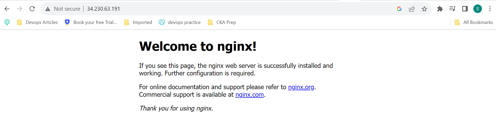

## PROJECT 4 LEMP STACK

### Create an EC2 instance on AWS console

### Refer to steps in Project 3 on how to create and launch an instance.

Esnure that you are able to SSH into the launched instanced via gitbash as shon below


Now that you have successfully logged into the instance you can start the installation of your LEMP stack.


## Install Nginx Webserver

### Update list of packages in the package manager

`sudo apt update` command updates the packages on the virtual machine

Run `sudo apt install nginx` to install the NGINX webserver


Confirm that nginx has successfully been installed by running the command `sudo systemctl status nginx`

The output will be similar to the image below;


🎉🎉🎉 Congratulations, Nginx has been installed successfully.🎉🎉🎉

Also run the command `curl -iv http://localhost:80` to confirm that the webpage is up and running.


Navigate to the public ip on port 80 on your web browser to view the Nginx welcome page.



🎉🎉🎉 Congratulations, Nginx has been installed successfully.🎉🎉🎉


## Install MySQL

Follow the same steps in Project 3 to install mysql server

Once the installation is successful, run the `sudo mysql` command to login.


## Install PHP

Follow the same steps in Project 3 to install PHP

## Configure Nginx to use the PHP Processor

Create the root web directory for your domain as follows;

`sudo mkdir /var/www/projectLEMP`

Assign ownership of the directory with the $USER environmental variable, referencing your current user.

`sudo chown -R $USER:USER /var/www/projectLEMP`

Open a new config file in the `sites-available` directory

`sudo vi /etc/nginx/sites-available/projectLEMP`

Make the following entry into the config file

`#/etc/nginx/sites-available/projectLEMP`

```
#/etc/nginx/sites-available/projectLEMP

server {
    listen 80;
    server_name projectLEMP www.projectLEMP;
    root /var/www/projectLEMP

    index index.html index.htm index.php;

    location / {
        try_files $uri/ =404;
    }

    location ~ \.php$ {
        include snippets/fastcgi-php.conf;
        fastcgi_pass unix:/var/run/php/php8.1-fpm.sock;
    
    }

    location ~ /\.ht {
        deny all;
    }

}


```
### definition of directives and location blocks

`listen` - port that nginx listens on.

`root` - document root where the files served by this webwsite are stored.

`index`- defines the priority of the default page to be displayed when requesting an URL without specifying one (e.g., http://localhost).

`server_name` - domain names and or IP addresses this server block should respond for.(Point this directive to your server's domain name or Public IP address.)

`location /` - the first location block includes a `try_files` directive, which checks for the existence of files or directories matching a URI request. It will return error 404 if nginx cant find the resource.

`location ~ \.php$` - This location block handles the actual PHP processing by pointing Nginx to the fastcgi-php.conf configuration file and the php7.4-fpm.sock file, which declares that the socket is associated with `php-fpm`.

location ~ /\.ht - The last location block deals with the `.htaccess files`, which nginx doesnt process. By adding the `deny all` directive, if any `.htaccess` file happens to find their way into the document root, they will not be served to visitors.

Save and close the file.

the config should be activated by linking by linking the config gile to Nginx's sites-enabled directory.

`sudo ln -s /etc/nginx/sites-available/projectLEMP /etc/nginx/sites-enabled/`

Test the config by running `sud nginx -t`


Disable nginx default host that is currently configured to listen on port 80, by running the following

`sudo unlink /etc/nginx/sites-enabled/default`

Reload nginx to apply changes

`sudo systemctl reload nginx`.

Create an index.html file in the new configured location by running the following command.

`sudo echo 'Hello LEMP from hostname' $(curl -s http://169.254.169.254/latest/meta-data/public-hostname) ' with public IP `

View the url on the browser to confirm the result


## Testing PHP with NGINX

Create a test php file in the document root. Open a file called `info.php`

`nano /var/www/projectLEMP/info.php`

Past the following lines into the file.

```
<?php
phpinfo();

```
Access the page in the browser.

`http://'server_domain_or_IP/info.php`


remove the test page
`sudo rm /var/www/projectLEMP/index.html`

## Retrieving data from MYSQL database with PHP

Follow the steps in Project 3 to set up a user and creat e and insert rows in the target DB dy running the following commands

`CREATE DATABASE 'example_database'`

`CREATE USER 'EXAMPLE_USER'@'%' IDENTIFIED WITH mysql_native_password BY 'sample_password'`

`GRANT ALL ON example_database.* TO 'example_user'@%'`

`CREATE TABLE example_database.todo_list (item_id INT AUTO_INCREMENT, content VARCHAR(255),PRIMARY KEY(item_id));`

`INSERT INTO example_databsae.todo_list (content) VALUES ("My fisrt import item)`

`INSERT INTO example_databsae.todo_list (content) VALUES ("My second import item)`

`INSERT INTO example_databsae.todo_list (content) VALUES ("My third import item)`

`INSERT INTO example_databsae.todo_list (content) VALUES ("And this one more thing)`

`SELECT * FROM todo_list;` to confirm that the entry has been inserted into the table.


## PHP script that connects to the mysql database

Create the script that connects to the mysql database to query the table

`nano /var/www/projectLEMP/todo_list.php`


Close the file

Access the page by visiting the domain name/IP address configured.

`http://<public_domain_or_IP>/todo_list.php`


🎖🎖🎖🎖🎉🎉🎉 Congratulations, The project has been completed successfully.🎉🎉🎉🥇🥇🥇🥇


