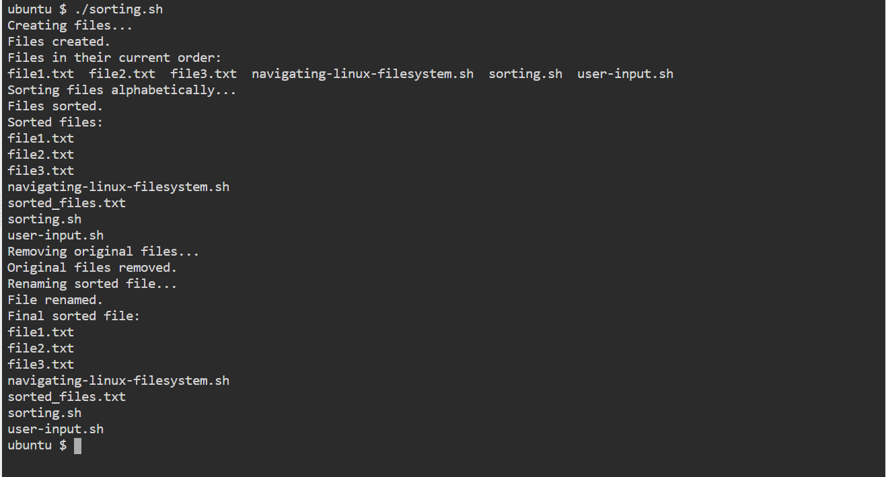

## PROJECT 5 SCRIPTING

Create a a directory and and change into that directory by running the follwing commands

```
mkdir shell-scripting

cd shell-scripting
```

### First script

Create a file called user-input.sh byrunning the following command `touch user-input.sh` Open the text editor `vi user-input.sh`
```
#!/bin/bash

# Prompt the user for their name
echo "Enter your name:"
read name

# Display a greeting with the entered name
echo "Hello, $name! Nice to meet you."

```
save the file and exit `:wq!`

make the file executable by running the following command

`chmod +x user-input.sh`

Execute the script by running the following command

`./user-input.sh`


### Second script

Create a file called navigating-linux-filesystem.sh byrunning the following command `touch navigating-linux-filesystem.sh` Open the text editor `vi navigating-linux-filesystem.sh`
```
#!/bin/bash

# Display current directory
echo "Current directory: $PWD"

# Create a new directory
echo "Creating a new directory..."
mkdir my_directory
echo "New directory created."

# Change to the new directory
echo "Changing to the new directory..."
cd my_directory
echo "Current directory: $PWD"

# Create some files
echo "Creating files..."
touch file1.txt
touch file2.txt
echo "Files created."

# List the files in the current directory
echo "Files in the current directory:"
ls

# Move one level up
echo "Moving one level up..."
cd ..
echo "Current directory: $PWD"

# Remove the new directory and its contents
echo "Removing the new directory..."
rm -rf my_directory
echo "Directory removed."

# List the files in the current directory again
echo "Files in the current directory:"
ls

```
save the file and exit `:wq!`

make the file executable by running the following command

`chmod +x navigating-linux-filesystem.sh`

Execute the script by running the following command

`./navigating-linux-filesystem.sh`


### Third script

Create a file called sorting.sh byrunning the following command `touch sorting.sh` Open the text editor `vi navigating-linux-filesystem.sh`
```
#!/bin/bash

# Create three files
echo "Creating files..."
echo "This is file3." > file3.txt
echo "This is file1." > file1.txt
echo "This is file2." > file2.txt
echo "Files created."

# Display the files in their current order
echo "Files in their current order:"
ls

# Sort the files alphabetically
echo "Sorting files alphabetically..."
ls | sort > sorted_files.txt
echo "Files sorted."

# Display the sorted files
echo "Sorted files:"
cat sorted_files.txt

# Remove the original files
echo "Removing original files..."
rm file1.txt file2.txt file3.txt
echo "Original files removed."

# Rename the sorted file to a more descriptive name
echo "Renaming sorted file..."
mv sorted_files.txt sorted_files_sorted_alphabetically.txt
echo "File renamed."

# Display the final sorted file
echo "Final sorted file:"
cat sorted_files_sorted_alphabetically.txt


```
save the file and exit `:wq!`

make the file executable by running the following command

`chmod +x sorting.sh`

Execute the script by running the following command

`./sorting.sh`




### Fourth script

Create a file called calculator.sh by running the following command `touch calculator.sh` Open the text editor `vi calculator.sh`
```

#!/bin/bash

# Define two variables with numeric values
num1=10
num2=5

# Perform basic arithmetic operations
sum=$((num1 + num2))
difference=$((num1 - num2))
product=$((num1 * num2))
quotient=$((num1 / num2))
remainder=$((num1 % num2))

# Display the results
echo "Number 1: $num1"
echo "Number 2: $num2"
echo "Sum: $sum"
echo "Difference: $difference"
echo "Product: $product"
echo "Quotient: $quotient"
echo "Remainder: $remainder"

# Perform some more complex calculations
power_of_2=$((num1 ** 2))
square_root=$(echo "sqrt($num2)" | bc -l)

# Display the results
echo "Number 1 raised to the power of 2: $power_of_2"
echo "Square root of number 2: $square_root"

```
save the file and exit `:wq!`

make the file executable by running the following command

`chmod +x calculator.sh`

Execute the script by running the following command

`./sorting.sh`


### Fifth script

Create a file called backup.sh by running the following command `touch backup.sh` Open the text editor `vi backup.sh`
```

#!/bin/bash

# Define the source directory and backup directory
source_dir="/path/to/source_directory"
backup_dir="/path/to/backup_directory"

# Create a timestamp with the current date and time
timestamp=$(date +"%Y%m%d%H%M%S")

# Create a backup directory with the timestamp
backup_dir_with_timestamp="$backup_dir/backup_$timestamp"

# Create the backup directory
mkdir -p "$backup_dir_with_timestamp"

# Copy all files from the source directory to the backup directory
cp -r "$source_dir"/* "$backup_dir_with_timestamp"

# Display a message indicating the backup process is complete
echo "Backup completed. Files copied to: $backup_dir_with_timestamp"
```
save the file and exit `:wq!`

make the file executable by running the following command

`chmod +x backup.sh`

Execute the script by running the following command

`./backup.sh`


🎖🎖🎖🎖🎉🎉🎉 Congratulations, The project has been completed successfully.🎉🎉🎉🥇🥇🥇🥇