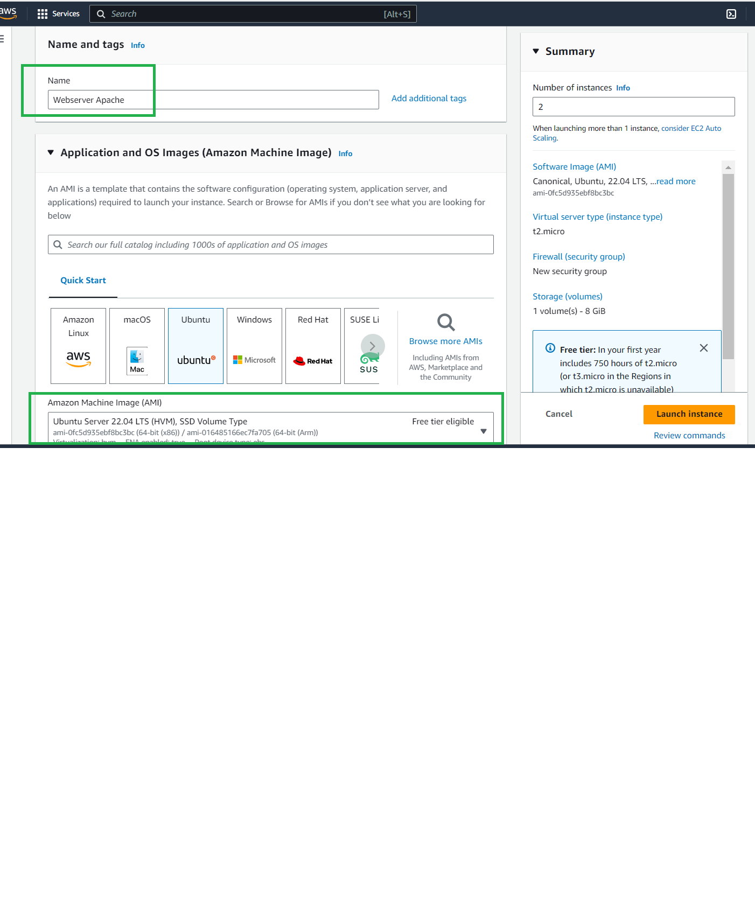

## Setting up a basic Load Balancer

#### Step 1

Provision two EC2 instances running on Ubuntu 22.04 and install apache Webserver in them, Open port 8000 to allow traffic from anywhere, update the default page of the webservers to display their public IP address.

Login to your AWS account, navigate to the EC2 page and create launch instance


Select the options for creating the EC2 instances, selct Ubuntu AMI and t2 micro instance type




Create the instances and check that they are running


Connect to any instance


Install Apache


Confirm that it is running


#### Step 2

#### Configure Apache to serve a page showing its public IP

Configure apached webserver to serve content on port 8000 instead of its default which is port 80. Then create a new index.html file. The file will contain code to display the public IP of the EC2 instance. Then overide apache websers default html file with the new file.

1. Using text editor, edit the file by running `sudo vi /etc/apache2/ports.conf`


2. Add directive to listen on port 8000


3. Change port in default settings


4. restart apache

`sudo systemctl restart apache2`

#### Step 3

Create new index.html file and replace it with the default index.html file by running the following commands

`vi index.html`

Place the following index.html code and insert the public IP of the machine


```
        <!DOCTYPE html>
        <html>
        <head>
            <title>My EC2 Instance</title>
        </head>
        <body>
            <h1>Welcome to my EC2 instance</h1>
            <p>Public IP: YOUR_PUBLIC_IP</p>
        </body>
        </html>


```
 Save the file 

 Save the changes


 

Navigate to the public IP of your instance on port 8000 and the following page should appear.


Reapeat the Steps above for the second apache webserver instance created.

#### Step 4

Provision a new EC2 instance for NGINX like we did in the steps above and configure it to accept HTTP traffic from anywhere on port 80


Log into the instance and Install Nginx


Confirm that nginx is running properly.


Edit the nginx lodbalancer configuration as follows;

`sudo vi /etc/nginx/conf.d/loadbalancer.conf`

```

        
        upstream backend_servers {

            # your are to replace the public IP and Port to that of your webservers
            server 127.0.0.1:8000; # public IP and port for webserser 1
            server 127.0.0.1:8000; # public IP and port for webserver 2

        }

        server {
            listen 80;
            server_name <your load balancer's public IP addres>; # provide your load balancers public IP address

            location / {
                proxy_pass http://backend_servers;
                proxy_set_header Host $host;
                proxy_set_header X-Real-IP $remote_addr;
                proxy_set_header X-Forwarded-For $proxy_add_x_forwarded_for;
            }
        }
    

```

Save the file.


Test your ngninx config by running the command

`sudo nginx -t`

restart nginx configuration
`sudo systemctl restart nginx`

Navigate to the public ip of nginx server and refresh to see how traffic is routed to the Apache webserver instances.


#### Clean up Infrastructure resources


